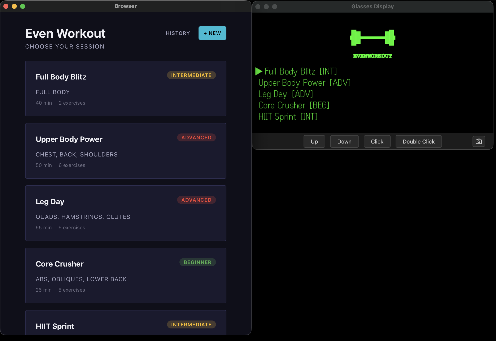
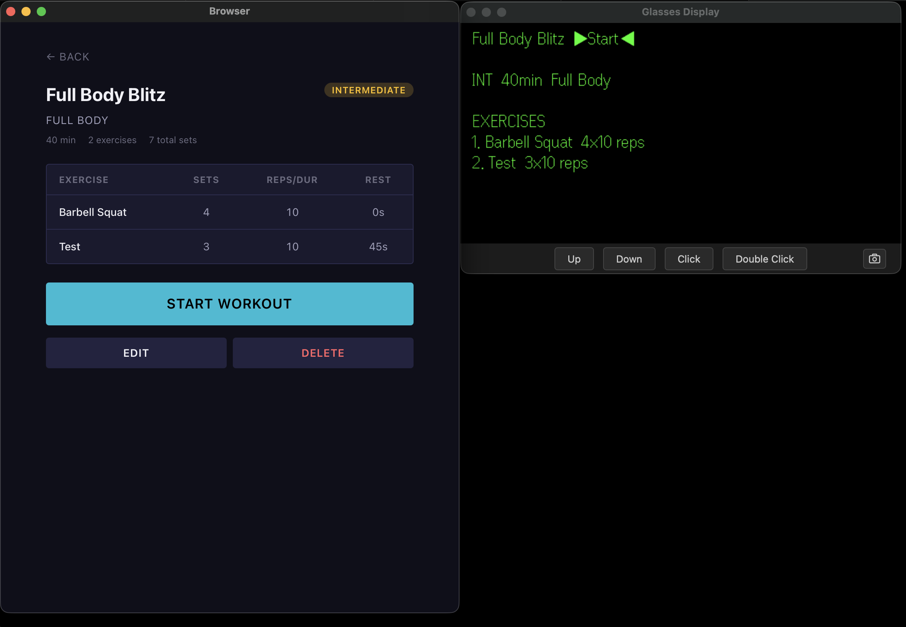
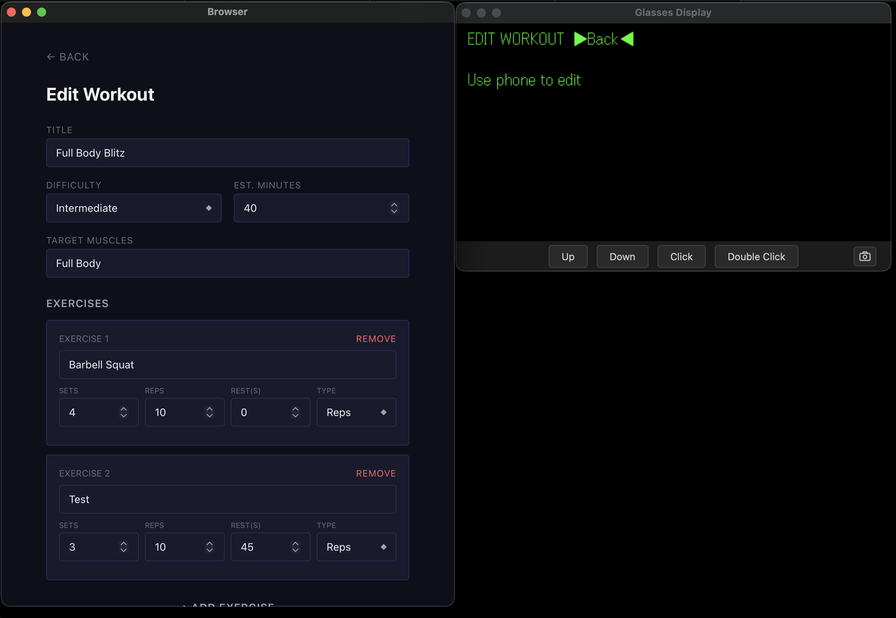
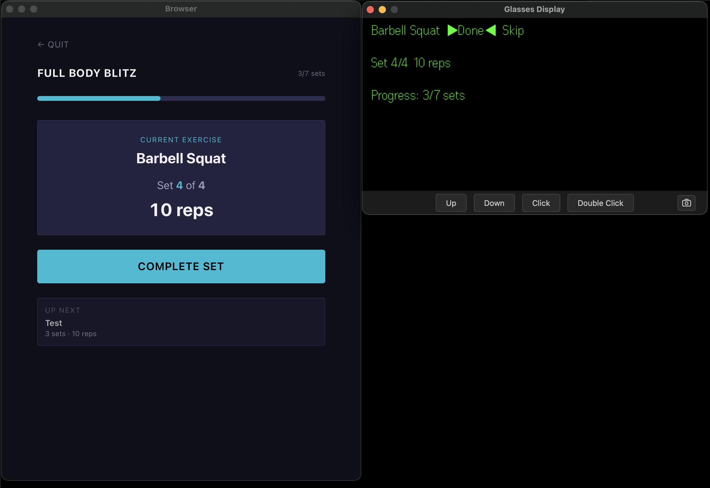
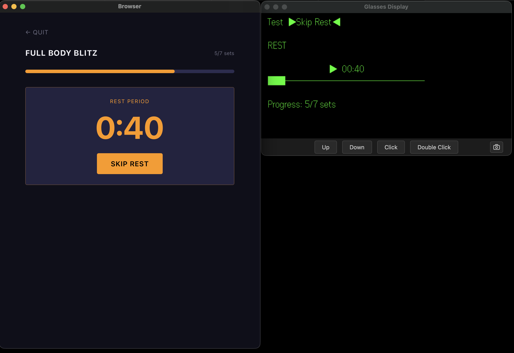
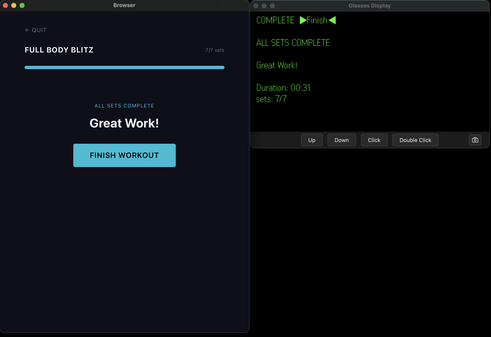
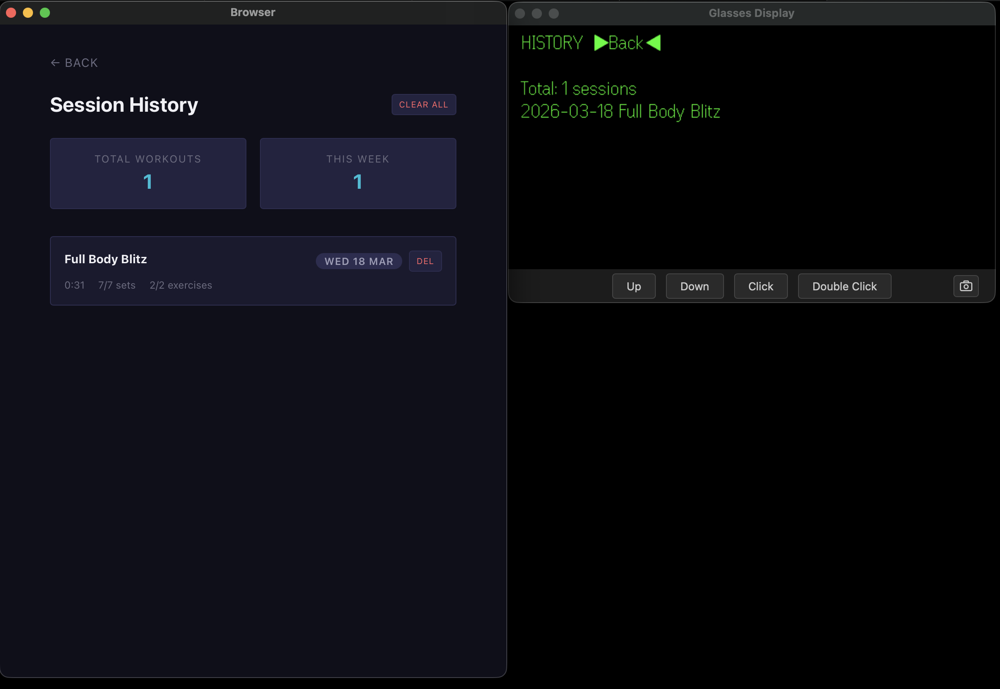

# EvenWorkout

A gym companion for **Even Realities G2 glasses**. Browse preset workouts or create your own, track sets, reps, and rest periods hands-free during training, and review your session history with stats.


---

## Features

### Workout Library
- 5 preset workouts included (Full Body Blitz, Upper Body Power, Leg Day, Core Crusher, HIIT Sprint)
- All workouts are fully editable and deletable — presets are yours to customize
- Create unlimited custom workouts



### Workout Detail
- Full overview: exercises, sets, reps/duration, rest times, difficulty, target muscles
- Start workout with one tap
- Edit or delete any workout



### Workout Editor
- Add exercises with sets, reps or timed duration, and rest periods
- Set rest to 0 for fast-paced exercises that skip the rest phase entirely
- Choose difficulty level and target muscle groups



### Active Workout Mode
- Guided set-by-set tracking: current exercise, set count, rep target
- Automatic rest countdown timer between sets with skip option
- Zero-rest exercises advance instantly — no flash, no delay
- Progress bar shows completed sets vs total
- Complete Set button advances through the workout



### Rest Timer
- Visual countdown between sets
- Skip rest at any time
- Automatically advances to next set when timer reaches zero



### Workout Complete
- Summary screen with duration, sets completed, and exercise count
- Session automatically saved to history



### Session History
- Every completed workout saved with date, duration, sets, and exercises
- Stats dashboard: total workouts, weekly count
- Delete individual records or clear all history



---

## G2 Glasses Integration

EvenWorkout is designed for hands-free gym use. Every screen has a dedicated glasses display with full navigation.

### Glasses: Workout List
- Scroll to browse all workouts
- Tap to select a workout
- Sliding window with scroll indicators for long lists

### Glasses: Workout Detail
- Workout name + `▶Start◀` button in top bar
- Scroll to read exercises, sets, and rest times
- Tap to start workout
- Double-tap to go back

### Glasses: Active Workout
- **Action buttons** in top bar: `[Done]` `[Skip]` during exercises, `[Skip Rest]` during rest
- Current exercise name, set count, rep target displayed
- Rest timer with visual progress bar (`████────────`)
- Progress counter: completed sets / total sets
- Active mode shows **blinking triangles** (`▶◀` / `▷◁`)

### Glasses: Complete
- `COMPLETE` header + `▶Finish◀` button
- Duration (frozen at finish time) and sets summary
- Tap to return to workout list

### Glasses: History
- Scrollable session list with dates and workout names
- Double-tap to go back

---

## Demo

[](docs/videos/demo.mp4)

---

## Tech Stack

- **React 19** + **TypeScript** + **React Router 7**
- **Tailwind CSS 4** with CVA (Class Variance Authority)
- **Even Realities SDK** (`@evenrealities/even_hub_sdk` + `@jappyjan/even-better-sdk`)
- **even-toolkit** shared library for glasses display, action mapping, input handling, timer display
- **Vite 5** for development and builds
- All data stored locally in **localStorage** — no server, no user data collection

## Project Structure

```
even-workout/
  src/
    App.tsx                     # Routes
    main.tsx                    # Entry point
    types/workout.ts            # Workout, Exercise, SessionRecord types
    data/
      workouts.ts               # 5 preset workouts
      persistence.ts            # localStorage read/write
    contexts/
      WorkoutContext.tsx         # Workout CRUD, active state, session history
    hooks/
      useRestTimer.ts           # Rest countdown + auto-advance
      useWorkoutProgress.ts     # Current exercise, set, progress calculation
      useWorkoutActions.ts      # completeSet, skipRest, finishWorkout
    screens/
      WorkoutList.tsx           # Home: workout cards
      WorkoutDetail.tsx         # Workout overview + start/edit/delete
      WorkoutEditor.tsx         # Create/edit workout form
      ActiveWorkout.tsx         # Guided workout mode
      WorkoutComplete.tsx       # Finish screen with stats
      SessionHistory.tsx        # Past sessions + stats dashboard
    components/
      ui/                       # Button, Card, Badge, Progress
      shared/                   # WorkoutCard, ExerciseCard, RestTimer, DifficultyBadge
    glass/
      WorkoutGlasses.tsx        # Glass hook + snapshot
      selectors.ts              # Display rendering for all screens
      actions.ts                # Glass action handler (scroll/tap/back)
      splash.ts                 # App splash tile
    utils/
      i18n.ts                   # Translation strings
      format.ts                 # Time formatting
      cn.ts                     # Tailwind class merge
    styles/app.css              # Theme + global styles
```

## Getting Started

```bash
# Install dependencies
npm install

# Start development server (accessible on local network for glasses testing)
npm run dev

# Build for production
npm run build

# Generate QR code for Even Hub testing
npx @evenrealities/evenhub-cli qr --port 5173 --path / --ip <your-local-ip>
```

## License

MIT
